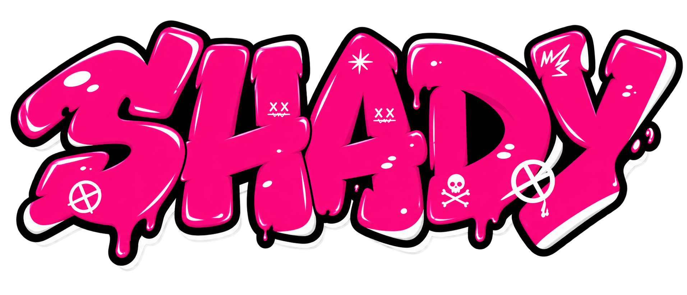

<div align="center">



# Shady Ramzy — Portfolio Website

A modern and responsive personal portfolio website built for **Shady Ramzy**, a Streamer and Content Creator.

A modern creator portfolio designed to showcase Shady Ramzy’s content, gaming presence, social platforms, and digital identity.

</div>

## ✨ Features

* Modern dark-themed design
* Fully responsive layout
* Smooth animations and transitions
* Social media integration
* Gaming & creator-focused interface
* Fortnite-inspired visual style
* Interactive content sections
* Mobile-friendly navigation
* Modern hover effects
* Responsive cards and layouts

## 🛠️ Built With

* HTML5
* CSS3
* JavaScript
* SVG Icons
* Google Fonts
* Responsive Web Design

## 🎨 Design

* Dark gaming-inspired interface
* Modern typography
* Neon-style accents
* Glow effects
* Smooth animations
* Interactive UI elements
* Responsive design
* Clean and modern layout

## 📂 Project Structure

```text
Shady-Ramzy/
│
├── Logo.png
├── README.md
├── index.html
├── script.js
└── style.css
```

## 🌐 Live Website

[](https://shady-ramzy.vercel.app/)

## </> Developer

Developed by **Raed Mosaed**

---

© 2026 Shady Ramzy
